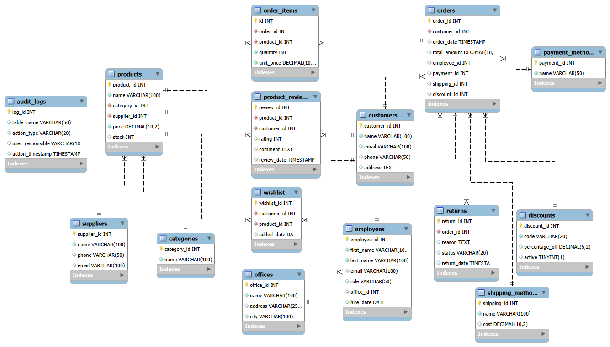

# 81860sql

## 📌 Overview

This project contains the development of a **relational database** designed for **Tierra de Osos**, a stuffed-toy retail business.

The purpose of this database is to support business operations by allowing owners and administrators to:

* Track product inventory.
* Manage customer orders.
* Maintain supplier information.
* Store relevant client data.

## 📂 Features

* Inventory management
* Order tracking
* Customer records
* Supplier management
* Product categorization
* Stock control

## 🧱 Database Structure

The relational model will include, at minimum, the following entities:

* **Suppliers**
* **Products**
* **Categories**
* **Customers**
* **Orders**
* **Order Items**

These entities are linked through primary and foreign key relationships, enabling consistent and reliable data queries.

## 📐 Entity-Relationship Diagram (ERD)

The database is conceptually based on the following relationships:

* A customer can place multiple orders
* Each order may contain multiple products
* Products are linked to categories
* Products are associated with one supplier
* Suppliers can provide multiple products



> [Link to Entity-Relationship Table in Excel](./public/table.xlsx)

## SQL Directory

This repository includes SQL files and supporting artifacts used to create, populate and inspect the Tierra de Osos database. Use this section as a quick guide to what you will find and how to run the files.

What to expect

* Schema/DDL file — SQL script that create the database schema (tables, constraints, indexes). Typical names: `schema.sql`, `ddl.sql`.
* Data/DML file — SQL script that insert sample data (seed data). Typical names: `data.sql`, `seed.sql`.
* Views file - SQL script 
* Functions file - SQL script 
* Stored Procedures file - SQL script 

Recommended execution order

1. Create the target database (and user) in your RDBMS.
2. Run the schema (DDL) script(s) to create tables and constraints.
3. Run the data (DML) script(s) to insert sample data.
4. Run any migration or convenience scripts last.

## 🧱 Data Base Schema (DDL)

```sql
CREATE TABLE customers (
    customer_id INT AUTO_INCREMENT PRIMARY KEY,
    name VARCHAR(100) NOT NULL,
    email VARCHAR(100) UNIQUE,
    phone VARCHAR(50),
    address TEXT
);

CREATE TABLE suppliers (
    supplier_id INT AUTO_INCREMENT PRIMARY KEY,
    name VARCHAR(100) NOT NULL,
    phone VARCHAR(50),
    email VARCHAR(100) UNIQUE
);

CREATE TABLE categories (
    category_id INT AUTO_INCREMENT PRIMARY KEY,
    name VARCHAR(100) NOT NULL
);

CREATE TABLE products (
    product_id INT AUTO_INCREMENT PRIMARY KEY,
    name VARCHAR(100) NOT NULL,
    category_id INT NOT NULL,
    supplier_id INT NOT NULL,
    price DECIMAL(10,2) NOT NULL CHECK (price >= 0),
    stock INT DEFAULT 0 CHECK (stock >= 0),
    FOREIGN KEY (category_id) REFERENCES categories(category_id) ON DELETE RESTRICT,
    FOREIGN KEY (supplier_id) REFERENCES suppliers(supplier_id) ON DELETE RESTRICT
);

CREATE TABLE orders (
    order_id INT AUTO_INCREMENT PRIMARY KEY,
    customer_id INT NOT NULL,
    order_date TIMESTAMP DEFAULT CURRENT_TIMESTAMP,
    total_amount DECIMAL(10,2),
    FOREIGN KEY (customer_id) REFERENCES customers(customer_id) ON DELETE CASCADE
);

CREATE TABLE order_items (
    id INT AUTO_INCREMENT PRIMARY KEY,
    order_id INT NOT NULL,
    product_id INT NOT NULL,
    quantity INT NOT NULL CHECK (quantity > 0),
    unit_price DECIMAL(10,2) NOT NULL CHECK (unit_price >= 0),
    FOREIGN KEY (order_id) REFERENCES orders(order_id) ON DELETE CASCADE,
    FOREIGN KEY (product_id) REFERENCES products(product_id) ON DELETE RESTRICT
);
```

## 📦 Sample Data (DML)

```sql
-- ============================================
-- PROVEEDORES
-- ============================================
INSERT INTO suppliers(name, phone, email) VALUES
('Fábrica de Osos', '+54-11-4567-8901', 'ventas@fabricadeosos.com'),
('Peluches Internacionales', '+54-11-4567-8902', 'contacto@peluchesinternacionales.com'),
('Peluches Premium SA', '+54-11-4567-8903', 'info@peluchespremium.com.ar'),
('Suministros Globales de Felpa', '+1-555-0199', 'pedidos@suministrosglobales.com'),
('Osos y Más', '+54-11-4567-8905', 'ventas@ososymas.com.ar');

-- ============================================
-- CATEGORÍAS
-- ============================================
INSERT INTO categories(name) VALUES
('Osos Clásicos'),
('Animales Salvajes'),
('Criaturas Fantásticas'),
('Colección Bebé'),
('Temporada y Festivos'),
('Peluches Gigantes');

-- ============================================
-- PRODUCTOS
-- ============================================
INSERT INTO products(name, category_id, supplier_id, price, stock) VALUES
-- Osos Clásicos
('Osito de Peluche Marrón 30cm', 1, 1, 4500.00, 35),
('Osito de Peluche Miel 40cm', 1, 1, 5200.00, 28),
('Oso Vintage Beige', 1, 3, 6800.00, 15),
('Mini Oso Llavero', 1, 5, 1200.00, 120),

-- Animales Salvajes
('Oso Polar 50cm', 2, 2, 5500.00, 22),
('Oso Grizzly Gigante', 2, 4, 12500.00, 8),
('Oso Panda 35cm', 2, 2, 4800.00, 30),
('Koala de Peluche', 2, 4, 3900.00, 25),
('Cachorro de León', 2, 3, 4200.00, 18),

-- Criaturas Fantásticas
('Unicornio Rosa 45cm', 3, 1, 6200.00, 20),
('Unicornio Arcoíris', 3, 1, 6500.00, 15),
('Dragón Azul', 3, 4, 7200.00, 12),
('Pegaso Blanco', 3, 2, 6800.00, 10),

-- Colección Bebé
('Osito Sonajero para Bebé', 4, 3, 2800.00, 45),
('Set de Mantita con Oso Suave', 4, 5, 5500.00, 20),
('Osito Musical', 4, 1, 4900.00, 18),

-- Temporada y Festivos
('Oso Navideño con Bufanda', 5, 1, 5800.00, 40),
('Oso de San Valentín con Corazón', 5, 3, 5200.00, 35),
('Oso Conejito de Pascua', 5, 5, 4700.00, 28),

-- Peluches Gigantes
('Osito Gigante 120cm', 6, 4, 18500.00, 5),
('Panda Mega 100cm', 6, 2, 15800.00, 6);

-- ============================================
-- CLIENTES
-- ============================================
INSERT INTO customers(name, email, phone, address) VALUES
('Ana López', 'ana.lopez@gmail.com', '+54-911-2345-6789', 'Av. Cabildo 1234, CABA'),
('Juan Pérez', 'juan.perez@gmail.com', '+54-911-3456-7890', 'Av. Corrientes 5678, CABA'),
('María González', 'maria.gonzalez@hotmail.com', '+54-911-4567-8901', 'San Martín 890, Vicente López'),
('Carlos Fernández', 'carlos.f@yahoo.com', '+54-911-5678-9012', 'Mitre 456, San Isidro'),
('Lucía Rodríguez', 'luciarodriguez@gmail.com', '+54-911-6789-0123', 'Belgrano 234, Olivos'),
('Roberto Martínez', 'rmartinez@outlook.com', '+54-911-7890-1234', 'Rivadavia 1122, CABA'),
('Sofía Díaz', 'sofia.diaz@gmail.com', '+54-911-8901-2345', 'Santa Fe 3344, CABA'),
('Diego Torres', 'diego.torres@gmail.com', '+54-911-9012-3456', 'Las Heras 567, CABA'),
('Valentina Ruiz', 'vale.ruiz@gmail.com', '+54-911-0123-4567', 'Libertador 2890, CABA'),
('Martín Sánchez', 'martin.sanchez@gmail.com', '+54-911-1234-5678', 'Callao 1567, CABA');

-- ============================================
-- PEDIDOS
-- ============================================
INSERT INTO orders(customer_id, order_date, total_amount) VALUES
(1, '2025-01-05 10:30:00', 9000.00),
(2, '2025-01-05 14:15:00', 18500.00),
(3, '2025-01-06 09:20:00', 12400.00),
(4, '2025-01-06 16:45:00', 5500.00),
(5, '2025-01-07 11:00:00', 24700.00),
(6, '2025-01-07 13:30:00', 8400.00),
(1, '2025-01-08 10:00:00', 15800.00),
(7, '2025-01-08 15:20:00', 6800.00),
(8, '2025-01-09 09:45:00', 11000.00),
(9, '2025-01-09 14:10:00', 10400.00),
(10, '2025-01-10 10:30:00', 7800.00);

-- ============================================
-- ÍTEMS DE PEDIDOS
-- ============================================
-- Pedido 1 (Ana López - 2 Ositos de Peluche)
INSERT INTO order_items(order_id, product_id, quantity, unit_price) VALUES
(1, 1, 2, 4500.00);

-- Pedido 2 (Juan Pérez - 1 Osito Gigante)
INSERT INTO order_items(order_id, product_id, quantity, unit_price) VALUES
(2, 20, 1, 18500.00);

-- Pedido 3 (María González - Pedido mixto)
INSERT INTO order_items(order_id, product_id, quantity, unit_price) VALUES
(3, 5, 1, 5500.00),
(3, 10, 1, 6200.00),
(3, 14, 1, 2800.00);

-- Pedido 4 (Carlos Fernández - Colección Bebé)
INSERT INTO order_items(order_id, product_id, quantity, unit_price) VALUES
(4, 15, 1, 5500.00);

-- Pedido 5 (Lucía Rodríguez - Pedido grande)
INSERT INTO order_items(order_id, product_id, quantity, unit_price) VALUES
(5, 6, 1, 12500.00),
(5, 7, 2, 4800.00),
(5, 17, 1, 5800.00);

-- Pedido 6 (Roberto Martínez - Animales Salvajes)
INSERT INTO order_items(order_id, product_id, quantity, unit_price) VALUES
(6, 8, 2, 3900.00),
(6, 4, 1, 1200.00);

-- Pedido 7 (Ana López - Segunda compra)
INSERT INTO order_items(order_id, product_id, quantity, unit_price) VALUES
(7, 21, 1, 15800.00);

-- Pedido 8 (Sofía Díaz - Fantasía)
INSERT INTO order_items(order_id, product_id, quantity, unit_price) VALUES
(8, 3, 1, 6800.00);

-- Pedido 9 (Diego Torres - Mixto)
INSERT INTO order_items(order_id, product_id, quantity, unit_price) VALUES
(9, 2, 1, 5200.00),
(9, 11, 1, 6500.00);

-- Pedido 10 (Valentina Ruiz - Temporada)
INSERT INTO order_items(order_id, product_id, quantity, unit_price) VALUES
(10, 17, 1, 5800.00),
(10, 18, 1, 5200.00);

-- Pedido 11 (Martín Sánchez - Bebé + Clásico)
INSERT INTO order_items(order_id, product_id, quantity, unit_price) VALUES
(11, 16, 1, 4900.00),
(11, 1, 1, 4500.00);
```

## 👤 Author

Designed and developed by **Tomás Mársico**

If you have questions, feel free to reach out or open an issue in the repository.

## 🌟 Final Notes

This database was created as a practical learning project to understand relational model design, SQL DDL/DML usage, and management of business information using a structured data model.

Thank you for checking out this project! 😊
